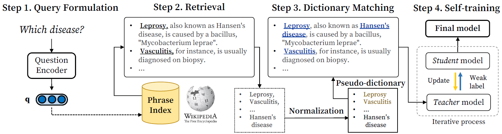

# GeNER
This repository provides the official code for **GeNER** (an automated dataset **Ge**neration framework for **NER**).

## Overview of GeNER

GeNER allows you to build NER models for specific entity types of interest **without** human-labeled data and and rich dictionaries. The core idea is to **ask simple natural language questions** to an open-domain question answering (QA) system and then **retrieve phrases and sentences**, as shown in the query formulation and retrieval stages in the figure below. Please see our paper ([Simple Questions Generate Named Entity Recognition Datasets](https://arxiv.org/abs/2112.08808)) for details.




## Requirements

Please follow the instructions below to set up your environment and install GeNER.

```bash
# Create a conda virtual environment
conda create -n GeNER python=3.8
conda activate GeNER

# Install PyTorch
conda install pytorch=1.9.0 cudatoolkit=11.1 -c pytorch -c conda-forge

# Install GeNER
git clone https://github.com/dmis-lab/GeNER.git
cd GeNER
pip install -r requirements.txt
```

### NER Benchmarks

Run `unzip data.zip` to unpack (pre-processed) NER benchmarks.

### QA Model and Phrase Index: DensePhrases

We use DensePhrases and a Wikipedia index precomputed by DensePhrases in order to automatically generate NER datasets.
Please download **the DensePhrases model** (<em>densephrases-multi-query-multi</em>) and **the phrase index** (<em>densephrases-multi_wiki-20181220</em>) in the official DensePhrases repository.

* [[GitHub](https://github.com/princeton-nlp/DensePhrases)] [[Paper](https://arxiv.org/abs/2012.12624)]

### AutoPhrase (Optional)

Using AutoPhrase in the dictionary matching stage usually improves final NER performance.
If you are using AutoPhrase to apply Rule 10 (i.e., refining entity boundaries), please check the system requirements in the AutoPhrase repository.
If you are not using AutoPhrase, set `refine_boundary` to `false` in a configuration file in the `configs` directory.

* [[GitHub](https://github.com/shangjingbo1226/AutoPhrase)][[Paper](https://arxiv.org/abs/1702.04457)]

### Computational Resource
Please see the resource requirement of DensePhrases and self-training, and check available resources of your machine. 

* **100GB RAM** and **a single 11G GPU** to run DensePhrases 
* **Single 9G GPU** to perform self-training (based on batch size 16)

## Reproducing Experiments

GeNER is implemented as a pipeline of DensePhrases, dictionary matching, and AutoPhrase.
The entire pipeline is controlled by configuration files located in the `configs` directory.
Please see `configs/README.md` for details.

We have already set up configuration files and optimal hyperparameters for all benchmarks and experiments so that you can easily reproduce similar or better performance to those presented in our paper. Just follow the instructions below for reproduction!

### Example: low-resource NER (CoNLL-2003)

This example is intended to reproduce the experiment in the low-resource NER setting on the CoNLL-2003 benchmark. If you want to reproduce other experiments, you will need to change some arguments including `--gener_config_path` according to the target benchmark.

#### Retrieval

Running `retrieve.py` will create `*.json` and `*.raw` files in the `data/retrieved/conll-2003` directory.

```bash
export CUDA_VISIBLE_DEVICES=0
export DENSEPHRASES_PATH={enter your densephrases path here}
export CONFIG_PATH=./configs/conll_config.json

python retrieve.py \
      --run_mode eval \
      --model_type bert \
      --cuda \
      --aggregate \
      --truecase \
      --return_sent \
      --pretrained_name_or_path SpanBERT/spanbert-base-cased \
      --dump_dir $DENSEPHRASES_PATH/outputs/densephrases-multi_wiki-20181220/dump/ \
      --index_name start/1048576_flat_OPQ96  \
      --load_dir $DENSEPHRASES_PATH/outputs/densephrases-multi-query-multi/  \
      --gener_config_path $CONFIG_PATH
```

#### Applying AutoPhrase (optional)

`apply_autophrase.sh` takes as input all `*.raw` files in the `data/retrieved/conll-2003` directory and outputs `*.autophrase` files in the same directory.

```bash
bash autophrase/apply_autophrase.sh data/retrieved/conll-2003
```

#### Dictionary matching

Running `annotate.py` will create `train.json`, `tag_to_id.json`, and `train_hf.json` files in the `data/annotated/conll-2003` directory.
Only the first two files are used in this repository, especially in the self-training stage. 
The last JSON file has the same data format as the Hugging Face Transformers library and is provided for your convenience.

```bash
python annotate.py --gener_config_path $CONFIG_PATH
```

#### Self-training

Finally, you can get the final NER model and see its performance. The model and training logs are stored in the `./outputs` directory. See the Makefile file for running experiments on other benchmarks.

```bash
make conll-low
```

## Fine-tuning GeNER

While GeNER performs well without any human-labeled data, you can further boost GeNER's performance using some training examples.
The way to do this is very simple: load a trained GeNER model from the `./outputs` directory and fine-tune it on training examples you have by a standard NER objective (i.e., token classification).
We provide a fine-tuning **script** in this repository (`self-training/run_ner.py`) and **datasets** to reproduce fine-grained and few-shot NER experiments (`data/fine-grained` and `data/few-shot` directories).

```bash
export CUDA_VISIBLE_DEVICES=0

python self-training/run_ner.py \
      --data_dir data/few-shot/conll-2003/conll-2003_0 \
      --model_type bert \
      --model_name_or_path outputs/{enter GeNER model path here} \
      --output_dir outputs/{enter GeNER model path here} \
      --learning_rate 1e-5 
```

## Building NER Models for Your Specific Needs

The main benefit of GeNER is that you can create NER datasets of new and different entity types you want to extract.
Suppose you want to extract <em>fighter aircraft</em> names.
The first thing you have to do is to formulate your needs as natural language questions such as "<em>Which fighter aircraft?</em>."

Next, you should make a configuration file (e.g., fighter_aircraft_config.json) and set up its values.
You can reflect questions you made in the configuration file as follows: `"subtype": "fighter aircraft"`.
Also, you can fine-tune some hyperparameters such as `top_k` and normalization rules.
See `configs/README.md` for detailed descriptions of configuration files.

```bash
{
    "retrieved_path": "data/retrieved/{file name}",
    "annotated_path": "data/annotated/{file name}",
    "add_abbreviation": true,
    "refine_boundary" : true,
    "subquestion_configs": [
        {
            "type": "{the name of pre-defined entity type}",
            "subtype" : "fighter aircraft",
            "top_k" : 5000,
            "split_composite_mention": true,
            "remove_lowercase_phrase": true,
            "remove_the": false,
            "skip_lowercase_ngram": 1
        }
    ]
}
```

For subsequent steps (i.e., retrieval, dictionary matching, and self-training), refer to the CoNLL-2003 example described above.

## Reference

Please cite our paper if you consider GeNER to be related to your work. Thanks!

```bibtex
@article{kim2021simple,
      title={Simple Questions Generate Named Entity Recognition Datasets}, 
      author={Hyunjae Kim and Jaehyo Yoo and Seunghyun Yoon and Jinhyuk Lee and Jaewoo Kang},
      year={2021},
      eprint={2112.08808},
      archivePrefix={arXiv},
      primaryClass={cs.CL}
}
```

## Contact

Feel free to email Hyunjae Kim `(hyunjae-kim@korea.ac.kr)` if you have any questions.

## License

See the LICENSE file for details.
