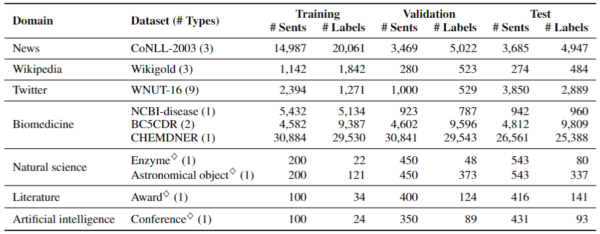

## Datasets

We release the pre-processed version of NER benchmarks used in our experiments.
Run `unzip benchmarks.zip` if you have not unpacked the benchmarks yet.

If the zip file has been unzipped successfully, there will be three directories in the `benchmarks` directory: `benchmarks/low-resource`, `benchmarks/fine-grained`, and `benchmarks/few-shot`.
Each directory contains datasets for specific experimental setups, such as few-shot NER, fine-grained NER, and few-shot NER.
See our paper for details.

### Data Format

We use the same format as that in the [BOND GitHub Repo](https://github.com/cliang1453/BOND/tree/master/dataset) since we use the code base of BOND during self-training and evaluation.

* `str_words`: list of input tokens.
* `tag`: list of label indexes, which are defined in the `tag_to_id.json` file.

### Statistics

Statistics of ten benchmarks are presented in the table below.

    

### References

#### CoNLL-2003

* Sang, Erik F., and Fien De Meulder. "Introduction to the CoNLL-2003 shared task: Language-independent named entity recognition." Proceedings of the Seventh Conference on Natural Language Learning at HLT-NAACL 2003.
* [[Paper](https://arxiv.org/abs/cs/0306050)]

#### Wikigold

* Balasuriya, Dominic, et al. "Named entity recognition in wikipedia." Proceedings of the 2009 workshop on the people’s web meets NLP: Collaboratively constructed semantic resources (People’s Web). 2009.
* [[Paper](https://aclanthology.org/W09-3302/)]

#### WNUT-16

* Strauss, Benjamin, et al. "Results of the wnut16 named entity recognition shared task." Proceedings of the 2nd Workshop on Noisy User-generated Text (WNUT). 2016.
* [[Paper](https://aclanthology.org/W16-3919/)]

#### NCBI-disease

* Doğan, Rezarta Islamaj, Robert Leaman, and Zhiyong Lu. "NCBI disease corpus: a resource for disease name recognition and concept normalization." Journal of biomedical informatics 47 (2014): 1-10.
* [[Paper](https://www.ncbi.nlm.nih.gov/pmc/articles/PMC3951655/)]

#### BC5CDR

* Li, Jiao, et al. "BioCreative V CDR task corpus: a resource for chemical disease relation extraction." Database 2016 (2016).
* [[Paper](https://www.ncbi.nlm.nih.gov/pmc/articles/PMC4860626/)]

#### CHEMDNER

* Krallinger, Martin, et al. "The CHEMDNER corpus of chemicals and drugs and its annotation principles." Journal of cheminformatics 7.1 (2015): 1-17.
* [[Paper](https://jcheminf.biomedcentral.com/articles/10.1186/1758-2946-7-S1-S2)]

#### Enzyme, Astronomical object, Award, Conference (CrossNER)

* Liu, Zihan, et al. "CrossNER: Evaluating Cross-Domain Named Entity Recognition." Proceedings of the AAAI Conference on Artificial Intelligence, 35. 2021.
* [[Paper](https://arxiv.org/abs/2012.04373)] [[GitHub](https://github.com/zliucr/CrossNER)]
